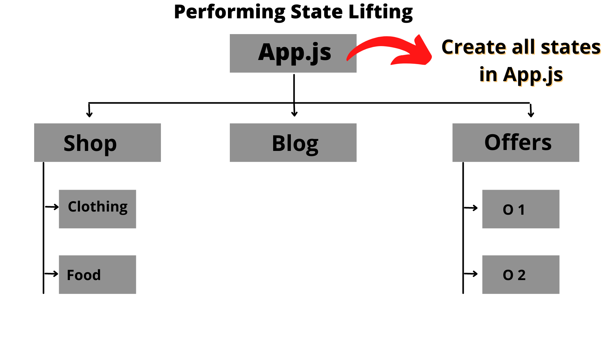
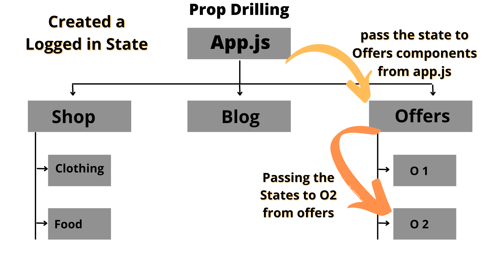
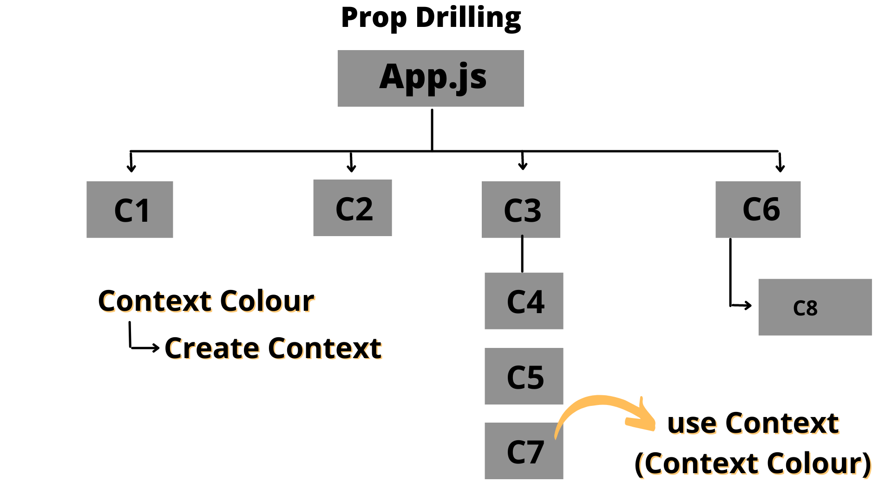

# Context API

## What is Context API ?

- It helps a react developer in managing complex application.

## Why use Context API?

- At a very high level, A react app consists of ‘state’ and ‘components’.
- As we already know that every component in React has its own state.
- Due to this reason, building and managing a complex application that has a large number of states and components isn’t an easy task.
- We can resolve this issue with the help of state lifting technique

## State Lifting

- It means sharing a state from one common source.
- State lifting is accompanied by lifting the state from the parent component as a source to pass the state to the children components.

    

- **Explantion** : we can create all the states in app.js(Parent component) as a javascript object, and now we can pass the state to child components. But, there still exists one major problem with this kind of approach.

## Prop Drilling Issue

- Prop drilling is a situation when the same data is being sent at almost every level due to requirements in the final level.
- Let’s assume that in the above application we have to check if the user is logged in while accessing the ‘clothing’ and ‘o2’ menus.
- In this scenario, if we use the state lifting method then we have to pass the logged-in state from app.js to every component.

    

- Here, we have to send the ‘login’ state to the ‘offers’ component and then to the ‘O2’ component.
- In this case, we have to perform a ton of prop drilling to use the logged-in state in the ‘offers’ and ‘O2’ Components.
- Hence, to resolve such issues in a complex react app, the developers use an amazing feature available in React, named Context API.

## Understanding Context API

- The Context API can be used to share data with multiple components, without having to pass data through props manually.
- Let’s deal with the similar prop drilling issue with the help of context API as shown below

    

- **Explanation** : In the above case, we have created a color state in App.js and now we want to use it in C7 and C8.
- To do so formally, we have to first pass the color to C7, in order to reach C8. A similar situation goes with C7 as well.
- However, A react developer can create a context, with the help of creating a context feature of the API. After doing that, any of the components in the react application can use a state directly without prop drilling.
