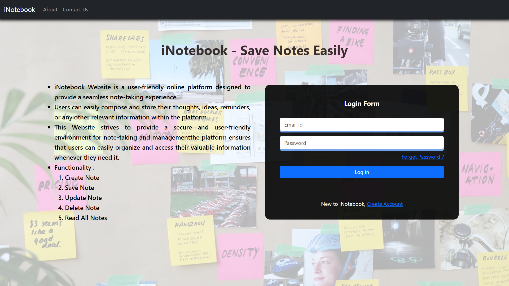

# iNotebook - Save Notes

iNotebook is a user-friendly online platform designed to streamline note-taking and organization. With features such as secure online storage, intuitive login and logout, versatile note management, powerful search functionality, and a modern technology stack, iNotebook empowers users to efficiently capture, manage, and access their thoughts and information. The platform's intuitive interface and robust features make it an ideal tool for students, professionals, and anyone seeking a more organized and efficient way to manage their notes.

## Technologies Used

- HTML
- CSS
- Javascript
- Bootstrap
- React
- Node
- Express
- Mongo
- MERN

## Getting Started

This section explains how to set up your project locally for development.

### Prerequisites

Make sure you have the following installed on your local machine:

- **Node.js**: [Download and install](https://nodejs.org/)
- **npm** or **yarn**: Comes bundled with Node.js.

### Installation

To install the project, follow these steps:

1. **Clone the repository:**

   ```bash
   git clone https://github.com/debugger-snjy/iNotebook-Save-Notes
   ```

2. **Installing the Node Packages:**

   ```bash
   npm install
   ```

3. **Running the Application:**

   ```bash
   npm start
   ```

4. **Running the Backend Project:**
   In this Project, we have added the Backend Project in the Main Folder Only (You can find the Backend Folder, Where we have the Backend Code)

5. **Running Project:**
   You can run `npm run both` and that will run the both the projects together, You can run these folder separately as well

## Screenshots

Login Page:


